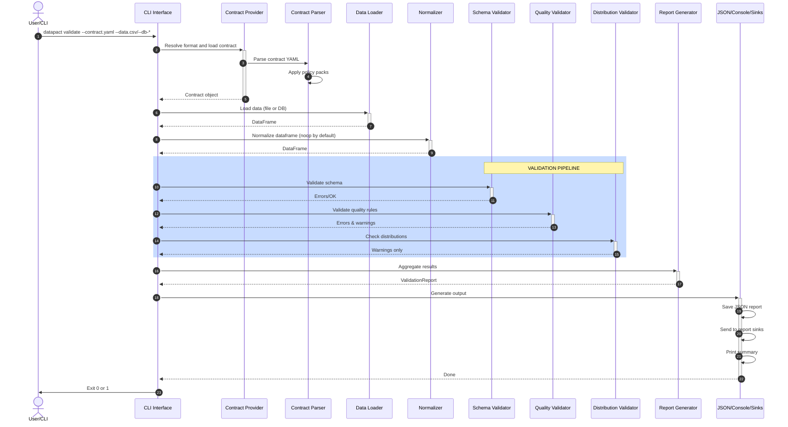

# 📊 Project Overview Dashboard

## Quick Stats

```
Project: DataPact
Version: 2.0.0
Status: ✅ PRODUCTION RELEASED (DataPact2.0 tag)
Created: February 8, 2026 | Updated: February 13, 2026

📁 Total Files:    139
💻 Code Files:     21 (Python modules)
📚 Docs Files:     18 (markdown + guides)
⚙️  Config Files:   4 (toml, yaml, gitignore)
🧪 Test Files:     15 test modules + 70 fixtures

📊 Code Statistics:
  Lines of Code:           ~1100+
   Type Hint Coverage:      100%
   Docstring Coverage:      Comprehensive
   External API Calls:      0 (local only)
    Test Cases:              118 (21 core + 17 versioning + 19 banking/finance + 2 concurrency + 2 profiling + 4 reporting + 2 policy packs + 42 exhaustive + 4 db source + 5 odcs)
   Code Coverage:           66%+

🔧 Supported Python:  3.9, 3.10, 3.11, 3.12
📦 Dependencies:      pandas, pyyaml, pyarrow, pact-python (+ optional psycopg2-binary, pymysql)
✅ CI/CD:            GitHub Actions configured
✨ Features:         Schema drift + Quality + SLA + Custom rules + Distribution validation + Chunked validation + Profiling + Rule Severity + Versioning with auto-migration + Report sinks + Policy packs + Database sources + Contract providers + Normalization scaffold + ODCS compatibility
```

## Documentation Structure

### 📖 For Different Audiences

| Audience | Start Here | Then Read |
|----------|-----------|-----------|
| **End Users** | [README.md](README.md) | [QUICKSTART.md](QUICKSTART.md) |
| **Developers** | [CONTRIBUTING.md](CONTRIBUTING.md) | [ARCHITECTURE.md](docs/ARCHITECTURE.md) |
| **AI Agents** | [.github/copilot-instructions.md](.github/copilot-instructions.md) | [FILE_REFERENCE.md](FILE_REFERENCE.md) |
| **Project Managers** | [DELIVERY_SUMMARY.md](DELIVERY_SUMMARY.md) | [SETUP_SUMMARY.md](SETUP_SUMMARY.md) |

### 📋 Complete Document List

```
Core Documentation (14 files):
├─ README.md                   User guide & feature overview
├─ FEATURES.md                 Functional feature list with examples
├─ QUICKSTART.md              Setup & quick start (5 min)
├─ CONTRIBUTING.md             Developer guide
├─ docs/ARCHITECTURE.md        Design decisions & data flow
├─ docs/VERSIONING.md         Version history & migration guide
├─ FILE_REFERENCE.md           File-by-file responsibilities
├─ PROJECT_STRUCTURE.md        Visual directory tree
├─ SETUP_SUMMARY.md            What was created
├─ COMPLETION_CHECKLIST.md    Feature & QA checklist
├─ DELIVERY_SUMMARY.md        Project overview & summary
├─ INDEX.md                    Navigation guide (this file)
├─ SEQUENCE_DIAGRAM_GUIDE.md  Sequence diagram guide
└─ VERSIONING_IMPLEMENTATION.md Versioning implementation notes

AI & Advanced Documentation (2 files):
├─ .github/copilot-instructions.md   AI coding guide (5.6 KB)
└─ docs/AI_INSTRUCTIONS_GUIDE.md    Template for AI instructions

Configuration (4 files):
├─ pyproject.toml             Python packaging
├─ setup.py                   Setuptools compatibility
├─ .gitignore                 Git exclusions
└─ .github/workflows/tests.yml GitHub Actions CI/CD
```

## Architecture Overview

```
┌─────────────────────────────────────────────────────────┐
│                   User / CI Pipeline                     │
│                  (CLI: datapact validate)                     │
└────────────────────┬────────────────────────────────────┘
                     │
        ┌────────────┴────────────┐
        ↓                         ↓
  Contract YAML              Data File / DB
        │                         │
  (validation)            (CSV/Parquet/JSON/DB)
        │                         │
        └────────────┬────────────┘
                     ↓
        ┌────────────────────────────┐
        │  Contract Parser (YAML →   │
        │  Python Models)            │
        └────────────┬───────────────┘
                     ↓
        ┌────────────────────────────┐
        │  Data Source Loader        │
        │  (DataFrame + schema)      │
        └────────────┬───────────────┘
                     ↓
        ┌────────────────────────────────────────┐
        │         VALIDATION PIPELINE            │
        ├────────────────────────────────────────┤
        │ 1. Schema Validator                    │
        │    (columns, types, required)          │
        │    → Blocking if critical issues       │
        ├────────────────────────────────────────┤
        │ 2. Quality Validator                   │
        │    (nulls, unique, ranges, regex, enum)│
        │    → Non-blocking                      │
        ├────────────────────────────────────────┤
        │ 3. SLA Validator                       │
        │    (min/max rows, freshness rules)     │
        │    → Non-blocking                      │
        ├────────────────────────────────────────┤
        │ 4. Custom Rule Validator               │
        │    (plugin-defined rules)              │
        │    → Non-blocking                      │
        ├────────────────────────────────────────┤
        │ 5. Distribution Validator              │
        │    (mean, std, drift detection)        │
        │    → Warnings only                     │
        └────────────┬───────────────────────────┘
                     ↓
        ┌────────────────────────────┐
        │ Error Aggregation & Report │
        │ Generation                 │
        └────────────┬───────────────┘
                     ↓
        ┌────────────────────────────┐
        │ Output: JSON + Console + Sinks │
        │ Exit Code: 0 or 1          │
        └────────────────────────────┘
```

## Sequence Diagram: Validation Flow



## Code Organization

```
src/datapact/
├── __init__.py              Package entry point
├── contracts.py             Contract parsing & models
│   ├─ Contract
│   ├─ Field
│   ├─ FieldRule
│   ├─ DistributionRule
│   ├─ Dataset
│   └─ FlattenConfig
├── providers/               Contract providers (format dispatch)
│   ├─ base.py               Abstract provider interface
│   ├─ datapact_provider.py  YAML contract loader
│   ├─ odcs_provider.py      ODCS v3.1.0 schema mapper
│   └─ pact_provider.py      Pact API contract type inference
├── policies.py              Policy pack registry
├── datasource.py            Data loading & inference
│   └─ DataSource
├── normalization/           Normalization scaffold
│   ├─ config.py
│   └─ normalizer.py
├── cli.py                   CLI interface
│   ├─ main()
│   ├─ validate_command()
│   ├─ init_command()
│   └─ profile_command()
├── profiling.py             Contract profiling helpers
├── reporting.py             Report generation
│   ├─ ErrorRecord
│   └─ ValidationReport
└── validators/              Validation pipeline
    ├── schema_validator.py
    ├── quality_validator.py
    └── distribution_validator.py
```

## Key Features Matrix

| Feature | Status | File |
|---------|--------|------|
| YAML Contract Parsing | ✅ | contracts.py |
| CSV Loading | ✅ | datasource.py |
| Parquet Loading | ✅ | datasource.py |
| JSON Lines Loading | ✅ | datasource.py |
| Schema Validation | ✅ | validators/schema_validator.py |
| Schema Drift Policy | ✅ | contracts.py |
| Quality Rules | ✅ | validators/quality_validator.py |
| SLA Checks | ✅ | validators/sla_validator.py |
| Distribution Monitoring | ✅ | validators/distribution_validator.py |
| Chunked Validation | ✅ | datasource.py |
| Profiling | ✅ | profiling.py |
| Rule Severity | ✅ | contracts.py |
| Policy Packs | ✅ | policies.py |
| Custom Rule Plugins | ✅ | validators/custom_rule_validator.py |
| Contract Providers | ✅ | providers/ |
| Pact API Contracts | ✅ | providers/pact_provider.py |
| ODCS Compatibility | ✅ | providers/odcs_provider.py |
| Normalization Scaffold | ✅ | normalization/ |
| JSON Report Output | ✅ | reporting.py |
| Console Output | ✅ | reporting.py |
| CLI: validate | ✅ | cli.py |
| CLI: init | ✅ | cli.py |
| Type Hints | ✅ | All files |
| Pytest Tests | ✅ | tests/test_validator.py |
| Test Fixtures | ✅ | tests/fixtures/ |
| GitHub Actions CI/CD | ✅ | .github/workflows/tests.yml |

## Development Workflow

```
1. SETUP
   └─ pip install -e ".[dev]"
   └─ PYTHONPATH=./src

2. DEVELOPMENT
   ├─ Edit code in src/
   ├─ Run tests: pytest tests/
   ├─ Format: black src/ tests/
   ├─ Lint: ruff check src/ tests/
   └─ Type check: mypy src/

3. VALIDATION
   ├─ python3 src/datapact/cli.py validate \
   │  --contract tests/fixtures/customer_contract.yaml \
   │  --data tests/fixtures/valid_customers.csv
   └─ Check reports/

4. COMMIT
   ├─ git add .
   ├─ git commit -m "Feature: ..."
   └─ GitHub Actions runs tests
```

## Testing Coverage

```
Unit Tests:
├─ TestSchemaValidator       (schema checks)
├─ TestQualityValidator      (quality rules)
├─ TestSLAValidator          (row count checks)
├─ TestChunkedValidation     (chunked validation)
├─ TestCustomRules           (plugin rules)
├─ TestDataSource            (loading & inference)
└─ TestDistributionValidator (distribution checks)

Test Data:
├─ customer_contract.yaml    (comprehensive contract)
├─ customer_contract_v1.yaml (legacy contract)
├─ customer_contract_v2.yaml (current contract)
├─ valid_customers.csv       (passes all checks)
├─ invalid_customers.csv     (intentional violations)
├─ deposits_contract.yaml    (deposits contract)
├─ lending_contract.yaml     (lending contract)
├─ deposits_data.csv         (deposits accounts)
├─ lending_data.csv          (lending loans)
├─ deposits_accounts_agg_contract.yaml (aggregate deposits contract)
├─ lending_loans_agg_contract.yaml     (aggregate lending contract)
├─ deposits_transactions_contract.yaml (deposits transactions contract)
├─ lending_payments_contract.yaml      (lending payments contract)
├─ deposits_transactions.csv  (deposits transactions)
├─ lending_payments.csv       (lending payments)
├─ deposits_accounts_agg.csv  (aggregate deposits)
└─ lending_loans_agg.csv      (aggregate lending)

Coverage:
├─ All validators            ✅
├─ All data formats          ✅
├─ All rule types            ✅
├─ Error conditions          ✅
└─ Report generation         ✅
```

## Validation Rules Reference

### Quality Rules
- **not_null** - Require no null values
- **unique** - All values must be distinct
- **min/max** - Numeric range constraints
- **regex** - Pattern matching
- **enum** - Value whitelist
- **max_null_ratio** - Tolerance for nulls
- **freshness_max_age_hours** - Max allowed timestamp age (hours)

### Distribution Rules
- **mean** - Expected average
- **std** - Expected standard deviation
- **max_drift_pct** - Alert threshold for changes
- **max_z_score** - Outlier detection threshold

## Error Severity Model

```
ERROR (blocks validation)
├─ Missing required columns
├─ Type mismatches
├─ Constraint violations
└─ Validation failures

WARN (informational)
├─ Extra columns not in contract (configurable)
├─ Distribution drift detected
├─ Statistical anomalies
└─ Soft constraint violations
```

## Report Output Example

```json
{
  "passed": false,
  "contract": {
    "name": "customer_data",
    "version": "2.0.0"
  },
  "dataset": {"name": "customers"},
  "metadata": {
    "timestamp": "2026-02-08T10:30:45",
    "tool_version": "0.2.0"
  },
  "summary": {
    "error_count": 2,
    "warning_count": 1
  },
  "errors": [
    {
      "code": "QUALITY",
      "field": "email",
      "message": "has 1 values not matching regex",
      "severity": "ERROR"
    }
  ]
}
```

## Quick Reference Commands

```bash
# Validate data
export PYTHONPATH=./src
python3 src/datapact/cli.py validate \
  --contract contract.yaml \
  --data data.csv

# Infer contract from data
python3 src/datapact/cli.py init \
  --contract new_contract.yaml \
  --data data.csv

# Run tests
pytest tests/test_validator.py -v

# Code quality
black src/ tests/
ruff check src/ tests/
mypy src/
```

## Next Actions

1. ✅ **Setup** - Follow [QUICKSTART.md](QUICKSTART.md)
2. 📖 **Learn** - Read [.github/copilot-instructions.md](.github/copilot-instructions.md)
3. 🧪 **Test** - Run `pytest tests/test_validator.py`
4. 🚀 **Build** - Create your own contracts
5. 📊 **Deploy** - Integrate into CI/CD pipelines

---

**Repository**: GitHub - meetnishant/DataPact  
**Status**: ✅ Production Ready (v2.0.0)  
**Release Tag**: DataPact2.0  
**Last Updated**: February 13, 2026
