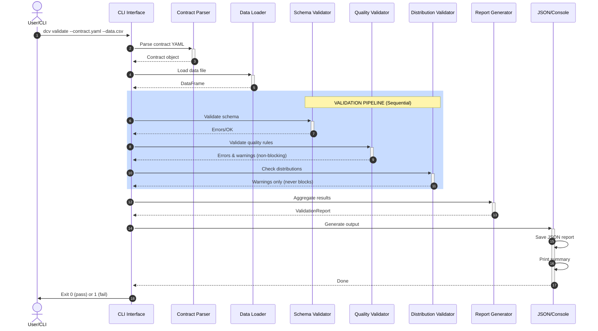

# Architecture

## High-Level Design

The Data Contract Validator follows a modular pipeline:

```
Contract YAML → Contract Parser → Validators → Report → JSON/Console
Data File → DataSource Loader ↓
```

## Key Components

### 1. **contracts.py** - Contract Parsing
- Parses YAML contract files into typed Python models
- Defines `Contract`, `Field`, `FieldRule`, `DistributionRule` dataclasses
- Handles contract versioning metadata
- Integrates with versioning module for auto-migration
- **Responsibility**: Contract validation, deserialization, and version management

### 2. **datasource.py** - Data Loading
- Loads CSV, Parquet, JSON Lines formats
- Auto-detects format from file extension
- Provides schema inference (column names and inferred types)
- **Responsibility**: Data I/O and schema discovery

### 3. **validators/** - Validation Pipeline
Three specialized validators run sequentially:

#### **schema_validator.py**
- Validates structure: column existence, types, required fields
- Runs first because structural issues block detailed validation
- Produces `ERROR` severity violations
- **Exit**: Errors prevent subsequent validators from running on affected fields

#### **quality_validator.py**
- Checks data content: nulls, uniqueness, ranges, patterns, enums
- Operates only on columns present in schema
- Produces both `ERROR` (constraint violations) and `WARN` (soft failures)
- **Input**: DataFrame + Field rules

#### **distribution_validator.py**
- Monitors numeric column statistics: mean, std, outlier detection
- Compares current vs. expected distributions
- Always produces `WARN` (never blocks validation)
- **Input**: DataFrame + Distribution rules

### 4. **reporting.py** - Report Generation
- Aggregates errors/warnings from all validators
- Produces machine-readable JSON and human-readable console output
- Tracks metadata: timestamp, contract version, tool version, breaking changes
- **Output**: `./reports/<timestamp>.json`

### 5. **versioning.py** - Version Management
- Maintains version registry for all contract versions
- Handles automatic migration between versions (1.0.0 → 1.1.0 → 2.0.0)
- Checks tool-contract compatibility
- Tracks breaking changes and deprecation status
- **Responsibility**: Version validation, migration, compatibility checking

### 6. **cli.py** - CLI Interface
- Entry point: parses arguments, orchestrates validation
- Performs version compatibility checking before validation
- Commands: `validate` (run validation), `init` (infer contract)
- Handles exit codes (0 = pass, 1 = fail with errors)

## Validation Semantics

1. **Schema validation** runs first
   - If required fields are missing, still continue (partial validation)
   - Type mismatches are recorded as ERRORs
2. **Quality validation** skips missing columns
3. **Distribution validation** is always non-blocking (WARNings only)
4. **Exit code** is non-zero if any ERRORs exist (for CI/CD)

## Data Flow Example

```yaml
# customer_contract.yaml
contract:
  name: customers
  version: 1.0.0
fields:
  - name: email
    type: string
    required: true
    rules:
      regex: '^[a-z]+@[a-z]+\.[a-z]+$'
```

```python
# Process
1. Contract.from_yaml() → Contract object
2. DataSource.load() → DataFrame with email column
3. SchemaValidator → checks email column exists, is string type
4. QualityValidator → checks regex matches all non-null emails
5. ValidationReport → aggregates results
6. report.save_json() → writes ./reports/20240115_103045.json
```

## Validation Sequence Diagram



## Contract Versioning

The framework supports multiple contract versions with automatic migration:

```
Old Contract (v1.0.0) → Auto-Migration → Latest Contract (v2.0.0) → Validation
       ↓
  Deprecation Warning
  Breaking Changes Tracked
  Migration Path Logged
```

### Version Registry
- **v1.0.0**: Legacy version (basic rules)
- **v1.1.0**: Enhanced version (adds max_z_score)
- **v2.0.0**: Current latest (refactored quality rules)

### Auto-Migration Process
1. Contract is loaded from YAML
2. Version is validated against registry
3. If not latest version:
   - Migration engine determines path (1.0→1.1 or 1.1→2.0)
   - Applies schema transformations
   - Logs deprecation warning to console
4. Contract is upgraded to v2.0.0
5. Validation proceeds with latest schema

### Tool Compatibility
- Tool version is tracked (currently 0.2.0)
- Compatibility matrix defines which tool versions support which contract versions
- Warnings issued if mismatch detected

See [docs/VERSIONING.md](VERSIONING.md) for detailed migration guide.

## Error Aggregation

All validators return `(bool, List[str])`:
- `bool`: Overall pass/fail
- `List[str]`: Detailed error messages

Messages are parsed to extract:
- Error code (SCHEMA, QUALITY, DISTRIBUTION)
- Severity (ERROR vs WARN)
- Field name
- Human-readable message

Version information added to reports:
- Current contract version
- Tool version
- Breaking changes (if any)
- Migration status

## Extensibility

To add a new validator:
1. Implement in `validators/new_validator.py` with `validate() -> Tuple[bool, List[str]]`

To add a new contract version:
1. Add to `VERSION_REGISTRY` in `versioning.py`
2. Implement migration path in `VersionMigration` class
3. Add test fixtures and tests
4. Update `docs/VERSIONING.md` with breaking changes
2. Import in `cli.py`
3. Call after appropriate validators in pipeline
4. Errors are automatically aggregated into report

To add new contract rules:
1. Add field to `FieldRule` or `DistributionRule` dataclass
2. Parse in `Contract._parse_rules()`
3. Check in corresponding validator
