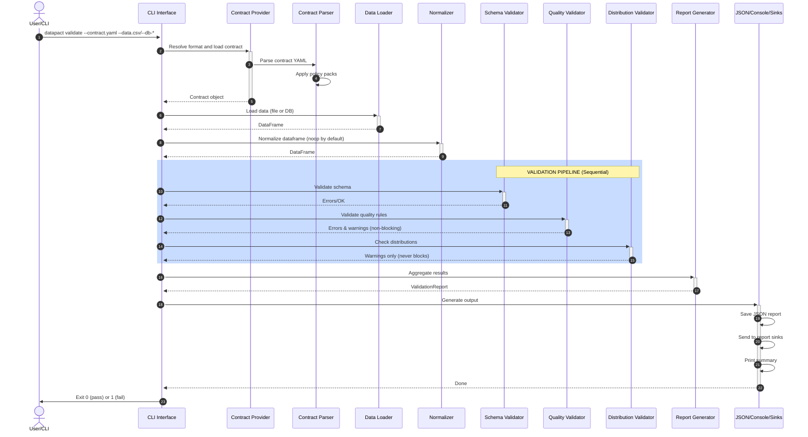

## Performance & NFR Testing


The project includes a suite of automated performance and non-functional requirements (NFR) tests to ensure DataPact remains robust, efficient, and production-ready at scale. These tests are located in `tests/test_performance.py` and `tests/test_performance_extra.py`.

See [PERFORMANCE_NFR_SUMMARY.md](../PERFORMANCE_NFR_SUMMARY.md) for the latest results, coverage, and CI integration details. Performance/NFR tests are run automatically in CI and reports are uploaded as artifacts.

### What is covered?
- **Large dataset validation time:** Validates 1M+ row CSVs and asserts runtime is within SLA.
- **Contract parsing speed:** Measures time to parse large contracts (100+ fields, 50+ rules each).
- **CLI startup time:** Ensures CLI responds quickly for small contracts.
- **Memory usage:** Checks RAM usage when loading and validating large files.
- **Batch and concurrent validation:** Runs many validations in sequence and in parallel to test throughput and scalability.
- **Performance degradation:** Measures how validation time scales with increasing data size.

### How to run
```bash
PYTHONPATH=src python3 -m pytest tests/test_performance.py tests/test_performance_extra.py --durations=10 --tb=short --maxfail=2 --junitxml=performance_report.xml
```
This will generate a JUnit XML report (`performance_report.xml`) with timing and pass/fail status for each scenario.

### Adding new NFR tests
- Add new scenarios to the performance test files.
- Use realistic data and contracts for benchmarking.
- Document any new NFRs in this section.
# Architecture

## Maintainers & Contributions

This project is maintained by the open-source community. Contributions are welcome via pull requests and issues. Please follow the code style and add tests for new features.

## High-Level Design

The DataPact follows a modular pipeline:

```
Contract YAML → Contract Provider → Contract Parser → Validators → Report → JSON/Console/Sinks
Data File / DB → DataSource Loader ↓
```

## Key Components

### 1. **contracts.py** - Contract Parsing
- Parses YAML contract files into typed Python models
- Supports ODCS v3.1.0 contracts via dedicated mapping
- Defines `Contract`, `Field`, `FieldRule`, `DistributionRule` dataclasses
- Handles contract versioning metadata
- Applies policy packs before field rule parsing
- Integrates with versioning module for auto-migration
- **Responsibility**: Contract validation, deserialization, and version management

### 1.1 **providers/** - Contract Providers
- Resolves contract format via provider dispatch (DataPact YAML, ODCS, or API Pact)
- Encapsulates format-specific compatibility checks and mapping
- **DataPact Provider**: Loads YAML contracts in native DataPact format
- **ODCS Provider**: Maps Open Data Contract Standard v3.1.0 schemas to DataPact format
- **Pact Provider**: Infers DataPact fields from Pact API contracts via response body type inference
  - **Type Inference**: Parses Pact JSON contracts and extracts field types from example response bodies
  - **Automatic Detection**: Uses `--contract-format pact` flag or auto-infers from `.json` extension
  - **Nested Support**: Schemas can be flattened for nested API responses (e.g., `user.address.city` → `user__address__city`)
  - **Limitations**: Type inference is automatic, but quality rules (uniqueness, ranges, regex, enums) and distribution rules must be added manually post-inference
  - **Workflow**: Infer base contract from Pact JSON → Review inferred types → Add custom quality/distribution rules → Validate API responses
  - **Example Fixture**: See `tests/fixtures/pact_user_api.json` for sample Pact contract with user API schema
- **Responsibility**: Format detection, contract loading, and type inference

### 2. **datasource.py** - Data Loading
- Loads CSV, Parquet, JSON Lines formats
- Loads database tables and queries (Postgres, MySQL, SQLite)
- Auto-detects format from file extension
- Provides schema inference (column names and inferred types)
- Supports chunked streaming for large CSV/JSONL files and database queries via `--db-chunksize`
- **Responsibility**: Data I/O and schema discovery

### 2.1 **normalization/** - Normalization Scaffold
- Provides a contract-aware normalization step (noop by default)
- Supports flatten metadata for future schema flattening
- **Responsibility**: Optional preprocessing before validation

### 3. **profiling.py** - Rule Profiling
- Generates contract rules from observed data
- Infers enums, ranges, null ratios, and distributions
- **Responsibility**: Baseline rule generation for new contracts

### 4. **validators/** - Validation Pipeline
Three specialized validators run sequentially:

#### **schema_validator.py**
- Validates structure: column existence, types, required fields
- Runs first because structural issues block detailed validation
- Produces `ERROR` severity violations
- Applies schema drift policy for extra columns (WARN/ERROR)
- **Exit**: Errors prevent subsequent validators from running on affected fields

#### **quality_validator.py**
- Checks data content: nulls, uniqueness, ranges, patterns, enums
- Operates only on columns present in schema
- Produces both `ERROR` (constraint violations) and `WARN` (soft failures)
- Supports rule-level severity metadata and CLI overrides

#### **sla_validator.py**
- Checks dataset SLAs (row count thresholds)
- Produces `ERROR` or `WARN` depending on SLA severity

#### **custom_rule_validator.py**
- Executes plugin-based custom rules
- Supports field-level and dataset-level checks
- **Input**: DataFrame + Field rules

#### **distribution_validator.py**
- Monitors numeric column statistics: mean, std, outlier detection
- Compares current vs. expected distributions
- Always produces `WARN` (never blocks validation)
- **Input**: DataFrame + Distribution rules

### 5. **reporting.py** - Report Generation & Lineage Tracking
- Aggregates errors/warnings from all validators
- Produces machine-readable JSON and human-readable console output
- Supports report sinks for file, stdout, and webhooks
- Tracks metadata: timestamp, contract version, tool version, breaking changes
- **Lineage tracking (Phase 9)**: `ErrorRecord` extends with optional `logical_path` and `actual_column` fields
  - `logical_path`: Contract field name or path (e.g., "user" or "user.id")
  - `actual_column`: Physical dataframe column after normalization (e.g., "user__id" if flattened with separator="__")
  - Enables error attribution when data is flattened or column-mapped
  - Console output shows lineage: "field 'email' (path: email, column: email_normalized)"
  - JSON output includes both fields for programmatic access
- **Output**: `./reports/<timestamp>.json`

### 6. **versioning.py** - Version Management
- Maintains version registry for all contract versions
- Handles automatic migration between versions (1.0.0 → 1.1.0 → 2.0.0)
- Checks tool-contract compatibility
- Tracks breaking changes and deprecation status
- **Responsibility**: Version validation, migration, compatibility checking

### 7. **cli.py** - CLI Interface
- Entry point: parses arguments, orchestrates validation
- Performs version compatibility checking before validation
- Commands: `validate` (run validation), `init` (infer contract), `profile` (infer rules)
- Handles exit codes (0 = pass, 1 = fail with errors)
- Supports chunked validation and sampling options for large datasets
- **Supports multiple contract formats**: DataPact YAML, ODCS, or API Pact JSON
- **Format Resolution**:
  - Auto-detects format from file extension (`.yaml` → DataPact, `.json` → Pact for API contracts)
  - Explicit format specification via `--contract-format datapack|odcs|pact`
  - YAML files follow DataPact or ODCS schemas based on structure
  - `.json` files with Pact contract structure automatically load via Pact provider
- **Pact CLI Examples**:
  ```bash
  datapact validate --contract pact_user_api.json --data api_response.json
  datapact validate --contract pact_user_api.json --data api_response.json --contract-format pact
  datapact validate --contract user_contract.yaml --data users.csv
  ```
- Applies normalization before validation

## Validation Semantics

1. **Schema validation** runs first and is blocking
  - If required fields are missing, stop early
  - Type mismatches are recorded as ERRORs
2. **Normalization** runs before validation (noop unless enabled)
3. **Quality validation** skips missing columns
4. **SLA validation** runs after quality checks (non-blocking)
5. **Custom rule validation** runs after SLA checks (non-blocking)
6. **Distribution validation** is always non-blocking (WARNings only)
7. **Exit code** is non-zero if any ERRORs exist (for CI/CD)

## Data Flow Example

```yaml
# customer_contract.yaml
contract:
  name: customers
  version: 2.0.0
fields:
  - name: email
    type: string
    required: true
    rules:
      regex: '^[a-z]+@[a-z]+\.[a-z]+$'
```

```python
# Process
1. Contract.from_yaml() → Contract object
2. DataSource.load() → DataFrame with email column
3. SchemaValidator → checks email column exists, is string type
4. QualityValidator → checks regex matches all non-null emails
5. ValidationReport → aggregates results
6. report.save_json() → writes ./reports/20260208_103045.json
```

## Validation Sequence Diagram



## Contract Versioning

The framework supports multiple contract versions with automatic migration:

```
Old Contract (v1.0.0) → Auto-Migration → Latest Contract (v2.0.0) → Validation
       ↓
  Deprecation Warning
  Breaking Changes Tracked
  Migration Path Logged
```

### Version Registry
- **v1.0.0**: Legacy version (basic rules)
- **v1.1.0**: Enhanced version (adds max_z_score)
- **v2.0.0**: Current latest (refactored quality rules)

### Auto-Migration Process
1. Contract is loaded from YAML
2. Version is validated against registry
3. If not latest version:
   - Migration engine determines path (1.0→1.1 or 1.1→2.0)
   - Applies schema transformations
   - Logs deprecation warning to console
4. Contract is upgraded to v2.0.0
5. Validation proceeds with latest schema

### Tool Compatibility
- Tool version is tracked (currently 0.2.0)
- Compatibility matrix defines which tool versions support which contract versions
- Warnings issued if mismatch detected

See [docs/VERSIONING.md](VERSIONING.md) for detailed migration guide.

## Error Aggregation

All validators return `(bool, List[str])`:
- `bool`: Overall pass/fail
- `List[str]`: Detailed error messages

Messages are parsed to extract:
- Error code (SCHEMA, QUALITY, DISTRIBUTION)
- Severity (ERROR vs WARN)
- Field name
- Human-readable message

Version information added to reports:
- Current contract version
- Tool version
- Breaking changes (if any)
- Migration status

## Extensibility

To add a new validator:
1. Implement in `validators/new_validator.py` with `validate() -> Tuple[bool, List[str]]`

To add a new contract version:
1. Add to `VERSION_REGISTRY` in `versioning.py`
2. Implement migration path in `VersionMigration` class
3. Add test fixtures and tests
4. Update `docs/VERSIONING.md` with breaking changes
2. Import in `cli.py`
3. Call after appropriate validators in pipeline
4. Errors are automatically aggregated into report

To add new contract rules:
1. Add field to `FieldRule` or `DistributionRule` dataclass
2. Parse in `Contract._parse_rules()`
3. Check in corresponding validator
